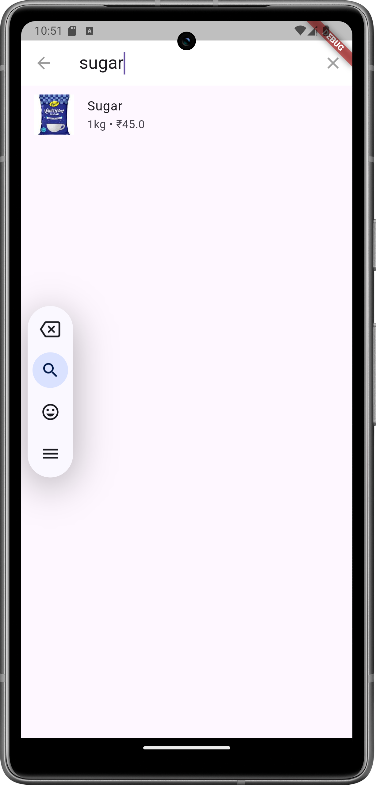

# Blinkit UI Clone - Flutter App

A simple Blinkit UI clone built using Flutter, showcasing layout, theming, search, product display, and light/dark mode toggle.

## Features

- Custom Top App Bar with location and profile
- Search functionality using `SearchDelegate`
- Horizontal category list
- Offers carousel
- Product grid with pricing and "Add" buttons
- Responsive design
- Portrait orientation lock

---

## 🚀 How to Run the App

### Prerequisites

Make sure you have the following installed:

- Flutter SDK (version 3.10 or above recommended)
- Android Studio or VS Code with Flutter extension
- Emulator or physical device

### Steps

1. **Clone the repo**
   ```bash
   git clone https://github.com/yourusername/blinkit_ui_flutter.git
   cd blinkit_ui_flutter
   
2. **Get dependencies**
    ```bash
   flutter pub get
   
3. Run the app
    ```bash
   flutter run

## 📸 Screenshots

### 🏠 Home Screen 





